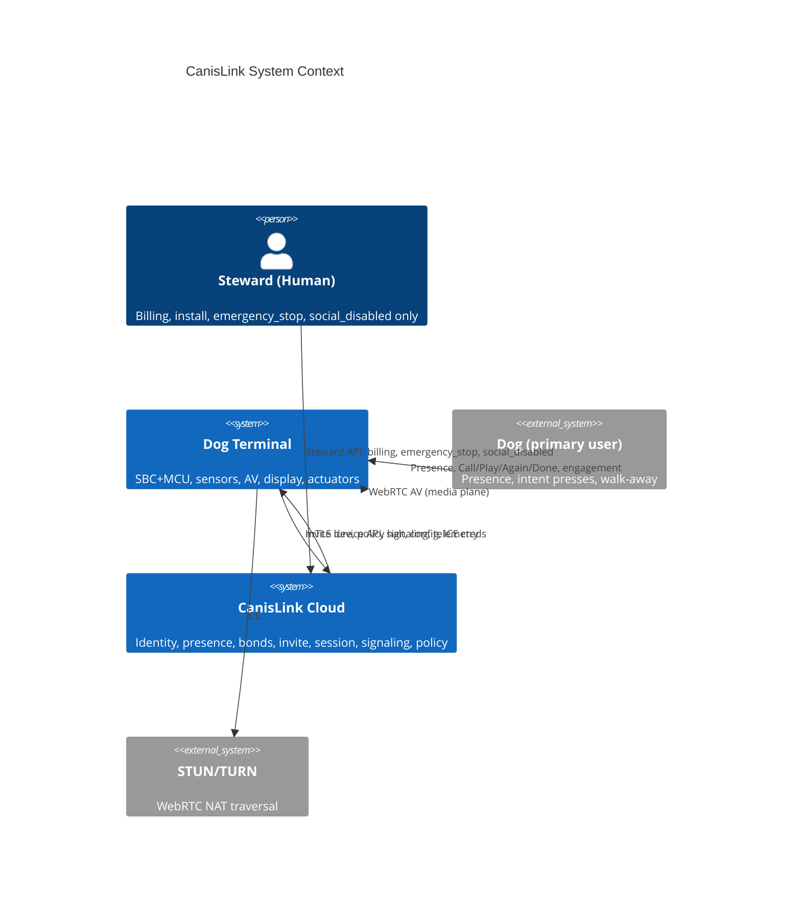
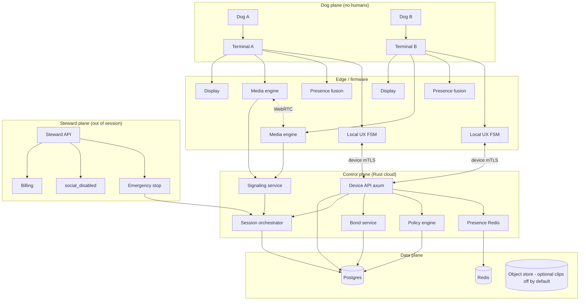
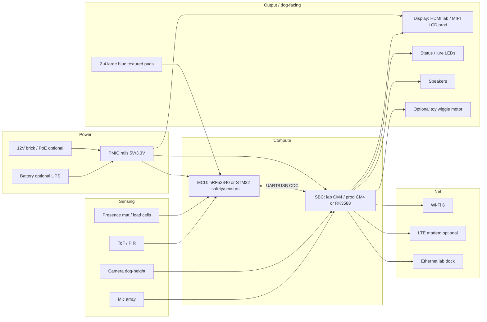
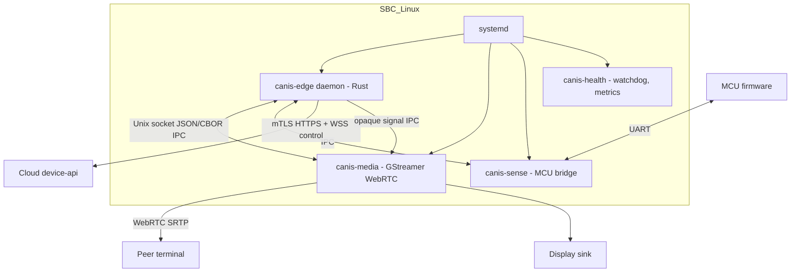
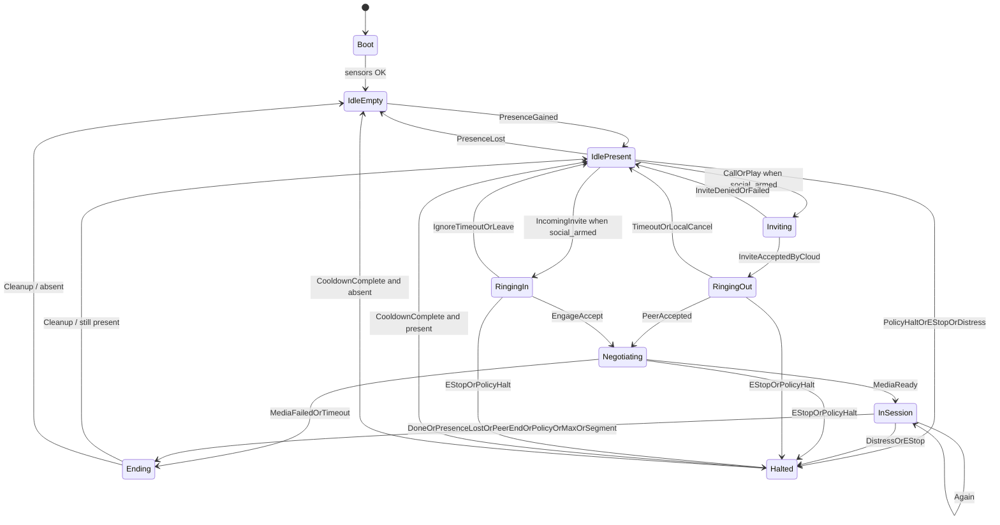
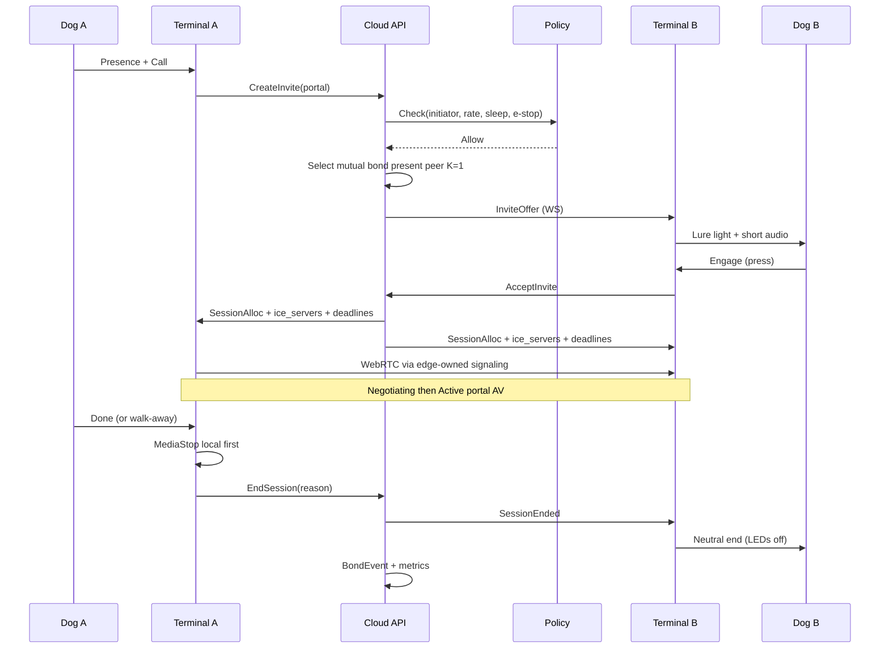
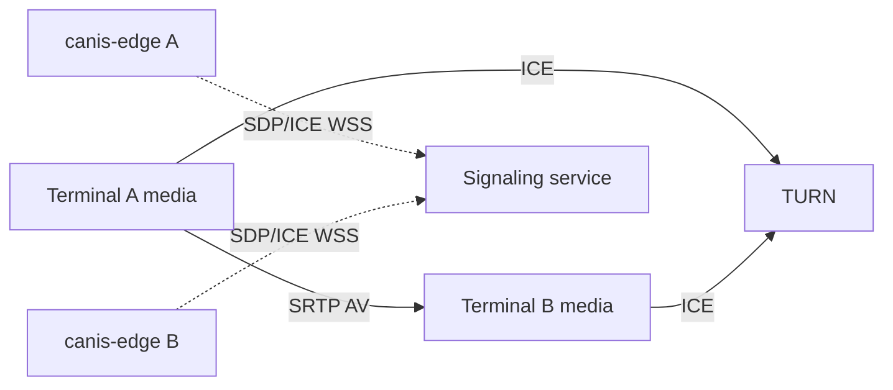
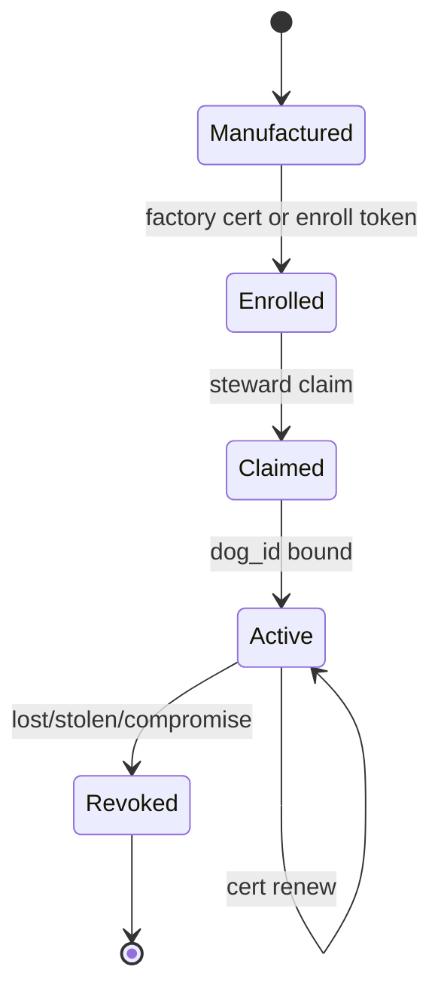

# CanisLink: Full Software and Hardware Architecture

| Field | Value |
|-------|-------|
| **Title** | CanisLink — Dog-to-Dog Social Portal Network: System Architecture |
| **Author** | Architecture / Systems (placeholder) |
| **Date** | 2026-07-09 |
| **Status** | Draft |
| **Version** | 0.3.0 |
| **Audience** | Senior engineers implementing monorepo, firmware, hardware, and cloud |
| **Revision** | 0.3.0 closes residual session-timer, WebRTC role, Halted/social_disabled, signaling socket, glare presence re-check, ConfigV1 sketch |

---

## Overview

CanisLink is a **dog-to-dog social portal network**: each dog has a standalone **social terminal** (not a phone accessory) that lets them initiate, accept, sustain, and end remote social contact with another dog — with **no human in the session protocol**. Humans are infrastructure only (purchase, power, install, rare emergency kill-switch / billing stewardship).

The product thesis is a presence graph + mutual invitation among small trusted eligibility (bond) graphs. Dog A at a terminal signals intent (Call/Play); the system routes only to eligible peer terminals where peer dogs are present; Dog B accepts by engaging with the lure/actuators or refuses by ignoring/leaving; session media (bidirectional AV, later synced toys) runs until either dog ends via walk-away or Done. Receiver signals are dog-native (light, short audio lure, optional toy wiggle) — never phone push to owners as the acceptance path.

This document is the **founding architecture** for a greenfield monorepo: hardware BOM and enclosure constraints, edge firmware, session state machines (edge ↔ cloud mapping), WebRTC media path, Rust cloud backend, Postgres/Redis data model, welfare/policy engine, security (device identity lifecycle), observability, lab test plan, risks, key decisions, and an ordered PR plan for incremental implementation.

---

## Background & Motivation

### Why this exists

Most "pet tech" inserts humans as the real users: phone apps, owner approvals, social feeds about dogs. That design fails the product constraint: **dogs must control social contact end-to-end**. Prior art in Animal–Computer Interaction (ACI) and canine cognition supports intentional button use for outcomes, ethical play with easy exit, and contingent consent — not dog–dog English chat or Instagram-for-dogs.

### Scientific grounding

| Stream | Relevance to CanisLink |
|--------|------------------------|
| **UCSD Rossano / Bastos button studies** | Dogs press large buttons intentionally for outcomes; presses are instrumental, not a shared linguistic medium between dogs. Architecture models **IntentEvents** (Call, Play, Again, Done), not chat messages. |
| **Bekoff play ethics** | Fair play, self-handicapping, clear signals, **easy exit**. Session design must make hang-up (walk-away / Done) as cheap as continue; distress → auto-halt. |
| **ACI ethics (Mancini et al.)** | Animal agency and **contingent consent**: ongoing engagement renews consent; leaving is valid refusal; humans do not approve each social request. |
| **Dogosophy / large button hardware** | ~80–120 mm blue, textured pads for paw/nose; few large actuators beat many small "vocabulary" buttons for v1. |
| **Hirskyj-Douglas dog video call work** | Dog-facing video call UX (camera height, attention, duration); **adapt from dog–human to dog–dog** portal: peer is another dog terminal, not an owner's phone. |

### Current state & pain points (greenfield)

- Empty workspace at monorepo root; no legacy code to migrate. This document is the source of truth until code lands.
- Industry default (BLE button → phone → human) violates non-goals and session purity.
- Need a full stack that is implementable: device identity, presence, invite routing, WebRTC, welfare policy, and a two-terminal lab path before scale.

### Explicit product non-goals (architecture must not optimize for these)

- Dog-to-dog English text chat / word soundboards as the social medium  
- Human social feed / Instagram for dogs  
- BLE button + phone app as **primary** architecture  
- Open global matching of stranger dogs in v1  
- Claiming full animal language  

---

## Goals & Non-Goals

### Goals

1. **Dog-controlled session protocol**: invite → accept-by-engage → media → end-by-walk-away/Done with zero human steps.
2. **Standalone terminal**: Wi-Fi or LTE; local SBC/MCU; not dependent on a phone for media or acceptance.
3. **Trusted eligibility graphs**: mutual bond-based routing among present peers; behavior-derived bond updates.
4. **Welfare-first policy**: rate limits, cool-downs, sleep windows, distress halt, max session duration.
5. **Implementation-ready monorepo**: Rust cloud + firmware-friendly edge, clear crates/services, PR-sliced delivery.
6. **Two-terminal lab prototype** within early PR sequence; production BOM path defined.

### Non-Goals (v1)

- Physical meetup automation / smart gates  
- Shared-object toys (phase 2; interfaces reserved)  
- Co-located multi-dog mesh (phase 2+)  
- Human content feed, likes, comments  
- ML "emotion recognition" as gate (v1 uses simple heuristics only)  
- Multi-region active-active cloud (single-region + DR later)  
- Biometric dog identification at the mat (terminal agency = bound dog; known limitation)  

---

## Naming Glossary (normative)

| Concept | Canonical name | Wire / DB values |
|---------|----------------|------------------|
| Dog intent pad events | `IntentKind` | `call`, `play`, `again`, `done` |
| Invite request mode | `InviteMode` | `portal` (from Call), `play_active` (from Play) |
| Live session mode | `SessionMode` | same as invite mode after accept; phase2 `play_object` |
| Cloud session FSM | `SessionState` | `none`, `invite_pending`, `ringing`, `negotiating`, `active`, `ending`, `closed`, `failed` |
| Edge UX FSM | `EdgeUxState` | see mapping table below |
| End reasons | `EndReason` | see enum section |

**Mapping intent → invite mode:** `Call` → `portal`; `Play` → `play_active`. During an active session, `Again` does not change mode.

---

## System Context & Layered Architecture

### Context diagram



### Layered architecture



### Logical domains

| Domain | Responsibility |
|--------|----------------|
| **Dog** | Stable identity of the animal (one primary terminal binding in v1) |
| **Terminal** | Device identity, certs, hardware capability profile |
| **Presence** | Live "occupant at terminal" with confidence + last_seen (**not** biometric dog ID) |
| **Bond** | Mutual weighted eligibility edges from behavior + steward bootstrap |
| **Invite** | Short-lived offer from initiator to one eligible present peer (K=1) |
| **Session** | Agreed social contact window + media + end reason |
| **IntentEvent** | Dog-facing control event (Call, Play, Again, Done) |
| **Steward** | Human account for purchase/billing/emergency/social_disabled only |

### v1 deploy topology (control plane)

- **Single region.**  
- **device-api**: start with **1 replica**; before multi-replica alpha, switch to **Redis pub/sub** so every replica subscribes to `invite:{dog_id}` / `session:{session_id}` / `policy:{dog_id}` and only the replica holding that dog's WS connection delivers. Do **not** rely on sticky sessions alone without the bus.  
- **signaling**: same pattern (session room membership in Redis).  
- **policy-worker**: 1 replica with leadership lock (Postgres advisory or Redis).  
- **Reconnect storms**: device WS exponential backoff (1s…60s jitter); cloud rate-limits new TLS handshakes per IP.  

---

## Hardware Architecture

### Lab reference platform (normative for L4 / pass criteria)

| Choice | Value | Rationale |
|--------|-------|-----------|
| **Lab SBC** | **Raspberry Pi CM4 8GB + official IO board** (Ethernet for lab) | Reproducible CI/lab; broad UVC/GStreamer support |
| **Lab display** | **External HDMI monitor 21–27"**, dog eye-line stand (lab exception) | Decouples enclosure from portal AV validation |
| Production SBC options | CM4-class **or** Rockchip RK3588 SoM on custom carrier | Variant BOM; not lab gate |
| Production display | Integrated **MIPI/HDMI LCD ~10–15"** (see OQ for projection) | Chew-safe bezel; prototype path validates AV first |

All lab SLO rows that depend on encode/first-frame (L4) are measured on the **lab reference platform** over Ethernet unless noted.

### Block diagram



### SBC vs MCU split (mandatory design)

| Concern | Owner | Rationale |
|---------|-------|-----------|
| WebRTC, camera, **display compose**, encoding, Wi-Fi/LTE, cloud mTLS, local UX orchestration | **SBC** | CPU/GPU, Linux userland, GStreamer WebRTC stack |
| Button debounce, presence sampling, hard safety (e-stop line), LED patterns under SBC hang | **MCU** | Low latency, always-on, independent of Linux freezes |
| Watchdog | MCU resets SBC / safe-state LEDs if SBC heartbeat lost | Welfare: never leave lure/session stuck "on" without dog agency |

**Protocol MCU↔SBC (v1):** framed COBS over UART 115200+; CRC-16/IBM; little-endian multi-byte fields; max frame payload 64 bytes. Message type registry:

| msg_type | Name | Direction | Payload |
|----------|------|-----------|---------|
| 0x01 | `Heartbeat` | both | u32 seq, u8 sbc_ok |
| 0x02 | `ButtonEvent` | MCU→SBC | u8 pad_id, u8 edge (down/up), u32 ts_ms |
| 0x03 | `PresenceSample` | MCU→SBC | i32 force_raw, u16 tof_mm, u8 flags |
| 0x04 | `LedCommand` | SBC→MCU | u8 pattern_id, u8 intensity |
| 0x05 | `SafetyTrip` | MCU→SBC | u8 reason |
| 0x06 | `WatchdogPet` | SBC→MCU | u32 token |

Normative detail lives in `docs/protocols/mcu-uart.md` (PR-17); registry above is frozen for v1.

### Major components (prototype vs production direction)

| Subsystem | Prototype / lab choice | Production direction | Notes |
|-----------|------------------------|----------------------|-------|
| SBC | **CM4 8GB + IO (lab reference)** | CM4-class or RK3588 SoM + carrier | Prefer H.264 HW encode (V4L2) |
| MCU | nRF52840 DK (UART) or STM32 Nucleo | Same family on carrier | BLE unused for session path |
| **Display** | **HDMI monitor 1080p (lab dock)** | Integrated 10–15" IPS, bright ≥300 nit, recessed bezel, optional AR film | **Required for portal**; projection is OQ only |
| Camera | USB UVC 1080p30–60 wide-angle, ~30–40 cm height | MIPI CSI sealed | Dog-height, chew-safe mount |
| Audio out | 2× 5–10 W class-D + sealed drivers | Custom enclosure tuning | Short lure clips ≤2 s pre-cached |
| Audio in | USB mic or I²S MEMS array (2–4) | AEC-capable array | Echo cancel for portal |
| Buttons | 80–120 mm dome, blue silicone texture, IP54 | Molded Dogosophy-style | **v1 prototype default: 4 pads** (Call, Play, Again, Done) |
| Presence | Floor mat pressure + VL53 ToF | Multi-load-cell + ToF fuse | False presence is invite spam risk |
| LEDs | Addressable ring + pad under-glow | Diffused, no hotspots | Lure: slow pulse; active: steady; halt: off |
| Toy actuator | Servo + soft toy (phase 2 lab) | Sealed wiggle unit | Not required for portal v1 |
| Network | Lab: **Ethernet**; field: Wi-Fi 6; LTE SKU optional | Wi-Fi primary | **Not** phone BLE for primary path |
| Power | 12 V / 5 A brick; UPS optional | PoE+ SKU optional | Physical power: steward install; soft-power for recovery OK (not session control) |

### Display subsystem (first-class)

| Concern | Spec |
|---------|------|
| Role | Render remote dog video + calm idle graphic; **not** a human UI/chrome surface in session |
| Lab | External HDMI; `canis-media` fullscreen sink |
| Production | Internal panel; no owner notification toasts on this surface |
| Chew | Recessed glass/plastic, no protruding corners; cable fully internal |
| Heat | Panel backlight in power budget; thermal trip dims panel then idles AV |
| Wash | Front IP54 with sealed bezel |
| Privacy | Local decode only; no stewards mirror |

### Enclosure constraints (dogs)

- **Floor stability**: wide base, low CoG; anti-tip weight or floor anchors for large dogs.
- **Chew**: no exposed soft cables; recessed connectors; food-grade silicone pad covers; metal or hard polycarbonate shell.
- **Wash**: IP54 minimum on user-facing surfaces; mat washable; no open grille at nose height for crumbs.
- **Heat**: vents dog-inaccessible; thermal trip → cool-down + steward telemetry metric `canis_edge_thermal_trip_total` and `telemetry.thermal_trip` flag (not dog-facing alarm spam).
- **Height**: display and camera at dog eye-line for size class (config: S/M/L).
- **Safety**: no pinch points on buttons; soft edges; toy motor torque-limited; treat dispenser out of v1 product path if choke risk.

### Power budget (prototype, approximate)

| Rail | Load | Est. |
|------|------|------|
| SBC active AV | 8–15 W | |
| **Display (panel/backlight)** | **5–12 W** (HDMI monitor lab often wall-powered separate) | |
| Camera + mics | 2–3 W | |
| Speakers peak | 5–10 W burst | |
| MCU + sensors + LEDs | <1 W | |
| **Idle present (integrated panel)** | ~10–18 W | |
| **Active session (integrated)** | ~20–35 W | |
| Lab with external HDMI PSU | terminal electronics ~15–25 W active; monitor separate | |

### Cost targets

| Tier | Hardware BOM target | Notes |
|------|---------------------|-------|
| **Lab prototype (×2)** | **$500–900 / terminal** | CM4 + MCU + sensors + buttons + **display path** (external monitor may be shared lab asset ~$100–200) |
| **Alpha field (×20)** | $300–500 / terminal | Partial custom enclosure, integrated or semi-integrated panel |
| **Production v1** | **$180–280 BOM aspirational** (ex-assembly) | Volume SoM + molded shell + panel; earlier $120–200 omitted display realism — treat $180–280 as planning floor |

---

## Firmware / Edge Architecture

### Process model (Linux SBC)



| Process | Language | Responsibility |
|---------|----------|----------------|
| `canis-edge` | Rust | Device auth, local UX FSM, invite/session client, **owns device control WSS + signaling WSS**, policy cache, IntentEvent publish, **media control plane via IPC** |
| `canis-media` | Rust + **GStreamer** (webrtcsink/webrtcsrc or custom pipeline) | Capture, HW encode where available, ICE/DTLS-SRTP, display sink, mute on halt; **does not** open cloud sockets |
| `canis-sense` | Rust | UART protocol, debounce, presence fusion publish to shared state |
| `canis-health` | Rust | Heartbeats to MCU, disk/temp/thermal_trip, crash reports |
| MCU FW | Rust (embassy) or C | Buttons, presence ADC, LEDs, safety |

### Edge ↔ media IPC (normative)

Transport: Unix domain socket `ipc:///run/canis/media.sock`, length-prefixed CBOR (or JSON in dev). Schema in `crates/media-signal` and `docs/protocols/edge-ipc.md`.

| Message | Dir | Fields | Purpose |
|---------|-----|--------|---------|
| `MediaStart` | edge→media | `session_id`, `role` (offerer/answerer), `ice_servers[]`, `force_turn`, `max_bitrate_kbps` | Start pipeline |
| `MediaStop` | edge→media | `session_id`, `reason` | Tear down |
| `MediaHalt` | edge→media | `session_id` | Immediate mute + pause encode (policy/e-stop) |
| `SignalOut` | media→edge | `session_id`, `payload` (SDP/ICE JSON) | Edge forwards on signaling WS |
| `SignalIn` | edge→media | `session_id`, `payload` | Edge delivers remote SDP/ICE |
| `MediaState` | media→edge | `session_id`, `state` (`starting`/`negotiating`/`ready`/`failed`/`stopped`), `rtt_ms?`, `error?` | Drive UX / `MediaReady` |
| `SetQuality` | edge→media | `session_id`, `height`, `fps`, `bitrate_kbps` | Adaptive / thermal |
| `GetStats` | edge→media | `session_id` | Metrics scrape helper |

**Signaling WebSocket ownership:** `canis-edge` only. Media never authenticates to cloud. This avoids dual-WS races (KD-18).

### Sensor fusion for presence

**Inputs:** load-cell / mat force `F`, ToF distance `d`, optional PIR motion, optional vision motion score (SBC, low rate).

**v1 fusion (simple, tunable):**

```
present_raw = (F > F_min for dog class) AND (d in [d_near, d_far] OR motion_recent)
present = debounce(present_raw, enter_ms=800, exit_ms=2500)
confidence = weighted combination of sensors online
```

- **Enter** faster than **exit** so walk-away ends sessions promptly (~2.5 s absence → `PresenceLost`).
- Publish to cloud every 2 s while present; heartbeat TTL **10 s** → cloud marks offline if missed.
- Local: presence drives whether Call/Play is armed; without presence, presses ignored (steward diagnostics only).

#### Presence ≠ dog biometric identity (v1 limitation)

v1 models **terminal agency**: the bound `dog_id` is attributed to whoever triggers presence on that terminal. Wrong dog, visitor dog, or multi-dog household can mis-attribute Call/Accept. Mitigations:

- Product guidance: **one primary dog per terminal area** in alpha.
- Bond graph still limits who can be reached.
- Optional non-blocking telemetry: `force_band` / weight-class estimate vs `dogs.size_class` (alert steward health channel only — **never** auto-deny social on mismatch in v1).
- Do **not** claim biometric identification until a later design.

### Button debounce & mapping

- Mechanical: 50 ms debounce on MCU; multi-press lockout 300 ms.
- Semantic mapping (configurable pad layout; **prototype default 4 pads**):

| Intent | Meaning | Typical pad |
|--------|---------|-------------|
| `Call` | "I want company" → invite bonded present peers (`InviteMode::portal`) | Pad 1 |
| `Play` | "I want active play" → `InviteMode::play_active` | Pad 2 |
| `Again` | Soft-extend session consent while Active | Pad 3 |
| `Done` | Withdraw consent / hard stop | Pad 4 |

- **Hold-Done 1.5 s** = local hard stop even if cloud unreachable: sequence (1) IPC `MediaStop`/`MediaHalt`, (2) local UX → Ending/Idle, (3) best-effort `POST /sessions/{id}/end` or queue offline.
- Momentary Done while online: same order — **local media tear-down first**, then cloud end (idempotent).
- No vocabulary words; no TTS of English for "chat."

### Local UX state machine



**`social_armed` (edge mode flag, not a SessionState):**  
`social_armed = present && !estop_active && !social_disabled && !in_local_sleep && !halt_cooldown`.  
When `social_disabled` is true, edge stays in **`IdlePresent` / `IdleEmpty`** (presence still tracked) but Call/Play **do not arm**, incoming invites are not lured (cloud should not offer; edge ignores offer), LEDs use calm “present but social off” pattern — **not** `Halted`.

**`Halted` is only for incident paths:** emergency_stop, PolicyHalt (distress/welfare halt), local distress halt. After halt cool-down (default **60 s** local, or until e-stop cleared for e-stop path):

- if `present` → **`IdlePresent`** (re-evaluate `social_armed`)  
- else → **`IdleEmpty`**

**Local LED/audio policy (receiver lure):** on `RingingIn`, ≤2 s audio lure + slow LED pulse, max **3** repeats with backoff from config `lure.max_repeats` / `lure.backoff_ms`; **never** push owner phone for accept.

### Edge UX ↔ Cloud SessionState mapping (normative)

Canonical pure FSM for **cloud session/invite** lives in `crates/session`. Edge uses `EdgeUxState` adapter. Dual-sided conformance tests must use this table.

| EdgeUxState | Cloud invite/session | Authoritative side | Notes |
|-------------|----------------------|--------------------|-------|
| `IdleEmpty` / `IdlePresent` | `SessionState::None` (no open invite/session for this dog) | both | Presence is orthogonal (Redis) |
| `Inviting` | `InvitePending` | cloud creates invite; edge waits result | Edge may still be IdlePresent if using async POST |
| `RingingOut` | `Ringing` (this dog = initiator) | cloud | Lure on peer only |
| `RingingIn` | `Ringing` (this dog = peer) | cloud delivers offer | Edge runs lure |
| `Negotiating` | `Negotiating` | cloud after accept; both edges | WebRTC signaling; media substate |
| `InSession` | `Active` | both after `MediaReady` from both or first media+timeout policy: **both edges report MediaReady OR 1 side ready + 3 s** → Active | Cloud marks Active on first MediaReady pair signal or edge `session.media_state` |
| `Ending` | `Ending` → `Closed` | end initiator edge local first; cloud commits | Bond events on Closed |
| `Halted` | session `Failed`/`Closed` with `PolicyHalt`/`EmergencyStop` only | cloud e-stop/policy halt; edge local distress | **Not** used for `social_disabled` (that is Idle* + `social_armed=false`) |
| `Idle*` + `social_disabled` | no open session; config flag | steward flag via config | Pads disarmed; presence OK; no lure |

**Who is authoritative for which transition:**

| Transition | Authority |
|------------|-----------|
| Create invite / route / expire ring / ignore close | **Cloud** |
| EngageAccept validation (present + pad) | **Edge** asserts; **cloud** re-checks presence + ring state |
| Start Negotiating / allocate session_id | **Cloud** |
| MediaReady / MediaFailed | **Edge** (media process) reports; cloud aggregates |
| Done / PresenceLost local | **Edge** ends media immediately; cloud is source of truth for peer notify |
| Hold-Done offline | **Edge** only until reconnect replay |
| PolicyHalt / EmergencyStop / MaxDuration (cloud tick) | **Cloud** push; edge also enforces **cached** max duration locally |
| SessionMaxDuration | **Both**: edge uses `session_started_at` + `max_session_sec` from config/session alloc; policy-worker is backup |

### Offline behavior

| Condition | Behavior |
|-----------|----------|
| Cloud unreachable, no session | Local presence UX only; queue telemetry; **no** multi-dog match |
| Cloud lost mid-session, **P2P healthy** | **Continue Active indefinitely** until local end (Done/presence/max-duration cache). Do **not** end solely because WS dropped. |
| Cloud lost and media broken / ICE needs restart that requires signaling | Start `media_orphan_timeout` **30 s**; then end `MediaFailed` |
| On reconnect | Edge **must** `GET /config` + `GET /session/active`. Apply `estop_active` → Halted/end media if set. Apply `social_disabled` → clear `social_armed` only (do not end Active). Resume `session.join` if active session remains. |
| MCU alive, SBC dead | MCU safe-state: LEDs off, no lure; wait SBC reboot |
| Partial network (TURN only) | Prefer TURN; log quality degrade; welfare: drop if RTT > budget sustained 30 s |

---

## Session Protocol

### Design principles

1. Humans are **not** in the state machine.  
2. Accept = **engagement** (presence maintained + pad press), not owner tap.  
3. Ignore / leave = valid refusal (no retry storm).  
4. Either dog can end anytime; ends are not "social failures" in UX lighting (neutral cool-down).  
5. **K=1** only in v1 — no multi-peer simultaneous lure.

### States (canonical cloud, `crates/protocol` / `crates/session`)

| State | Description |
|-------|-------------|
| `None` | No invite/session |
| `InvitePending` | Initiator request created; routing |
| `Ringing` | Delivered to exactly one peer terminal; lure active |
| `Negotiating` | Accepted; WebRTC signaling exchange |
| `Active` | Media flowing; welfare clocks running |
| `Ending` | Terminal hang-up; stats commit |
| `Closed` | Terminal state; bond events written |
| `Failed` | Timeout / policy / media failure |

### Events

| Event | Source |
|-------|--------|
| `IntentCall` / `IntentPlay` | Initiator terminal |
| `InviteRouted` | Cloud matcher |
| `InviteDelivered` | Peer edge ACK |
| `EngageAccept` | Peer: press Call/Play/Again while ringing + present |
| `IgnoreTimeout` | Peer: no accept within ring window → close reason `Ignored` |
| `PresenceLost` | Either side |
| `IntentDone` | Either side |
| `IntentAgain` | Either side during Active (soft renew) |
| `PolicyHalt` | Cloud or local policy |
| `EmergencyStop` | Steward API → cloud → both edges |
| `MediaReady` / `MediaFailed` | Media engines via edge |
| `SessionMaxDuration` | Edge local timer and/or policy-worker |
| `PeerBusy` | Cloud routing when peer not idle-present eligible |

### Timeouts & budgets (quantified)

| Parameter | Value | Rationale |
|-----------|-------|-----------|
| Invite → first lure on peer (**lab LAN**) | **≤ 500 ms** p95 | Cause–effect; L2 gate |
| Invite → first lure (**prod same-region**, warm WS) | **≤ 800 ms** p95 | Internet + TLS + DB; KD-14 |
| Invite → lure cold WS reconnect | **≤ 2.5 s** p95 | Separate SLO; not lab gate |
| Ring window | **25 s** | Approach pads; avoid lure spam |
| Accept → media first frame (**lab Ethernet**, warm ICE) | **≤ 2.5 s** p95 | L4 |
| Accept → media (**prod home Wi-Fi stretch**) | **≤ 5 s** p95 warm / **≤ 8 s** cold | Soften vs pure lab |
| Presence offline TTL | **10 s** | Cloud presence key |
| Local presence exit | **2.5 s** | Walk-away hang-up |
| Session max duration | **15 min** hard cap default | Fatigue / welfare |
| Soft segment initial | `segment_deadline_at = started_at + min(300s, max_session_sec)` | Contingent consent; auto-end `SegmentExpired` if not renewed |
| Soft segment after Again | `segment_deadline_at = min(now+300s, max_end_at)` | Unilateral renew; hard cap absolute |
| Cool-down after session | **5–15 min** (policy) | Spam / rest |
| Max concurrent invites out | **1** | Simple |
| Max ring-in | **1** (busy → `PeerBusy` to initiator) | Avoid pile-on |
| Media orphan timeout | **30 s** | Only when media broken under partition |
| Negotiate timeout | **15 s** | MediaFailed if no MediaReady |

**Delivery path:** Invites are pushed on the **persistent device WSS** (`/v1/ws`). REST alone is insufficient for lure SLO; cold reconnect is a separate path.

### Again / contingent consent renew (normative)

**v1 rule (A) soft-end segment — KD-19 refined:** session ends at the earlier of `segment_deadline_at` or `max_end_at` (or Done/presence/policy). Again is meaningful: it postpones soft-end, never past the hard cap.

| Rule | v1 decision |
|------|-------------|
| Mutual vs unilateral | **Unilateral soft-extend**: either dog pressing Again extends the soft segment for both |
| **Initial `segment_deadline_at` at SessionAlloc** | **`started_at + min(DEFAULT_SEGMENT_SEC, max_session_sec)`** where **`DEFAULT_SEGMENT_SEC = 300` (5 min)**. If `max_session_sec ≤ 300`, initial segment equals `max_end_at` (Again is no-op until hard cap only). |
| **On Again (while Active)** | `segment_deadline_at = min(now + 300s, max_end_at)`; both edges + cloud update; idempotent if already later |
| **On `segment_deadline_at` without Again** | **Auto-end session** with `EndReason::SegmentExpired` (distinct from `MaxDuration`). Edge and policy-worker both watch this timer. Media tear-down same as Done (local first). Neutral cool-down UX (not alarm). |
| Hard cap `max_end_at` | `started_at + max_session_sec`; end reason `MaxDuration` if hard cap hits first (or simultaneously prefer `MaxDuration`) |
| Timer ownership | **Edge primary** (local clocks from SessionAlloc); **policy-worker backup** every 5 s ends if either deadline passed |
| Peer notify on Again | Optional dim LED "continue" flicker once on peer — non-blocking; peer may Done/leave anytime |
| Outside Active | Again **ignored**; if RingingIn, Again counts as EngageAccept |
| Ethics | Soft-end implements contingent consent renewal; easy exit always available; no human "keep them on" |

**PR-03 golden tests required:** (1) alloc segment = start+5m; (2) no Again → SegmentExpired at 5m; (3) Again at 4m → ends at 9m if max allows; (4) Again cannot pass max_end_at; (5) MaxDuration wins when max < segment.

### Sequence: happy path portal



### Accept semantics (engagement)

v1 **EngageAccept** requires:

1. Peer terminal in `RingingIn`  
2. Peer presence `present == true`  
3. Explicit pad event: `Call` or `Play` or `Again` within ring window  

Cloud re-validates: invite state `Ringing`, peer dog matches, presence Redis key exists, no e-stop.

### Bond graph & routing algorithm (v1 normative)

**Directionality:** Eligibility requires a **mutual** pair of edges:

```
eligible(A→B) iff
  bonds(A,B).weight >= W_MIN AND bonds(B,A).weight >= W_MIN
```

- Steward bootstrap creates **both directions** at weight `0.5`.  
- Behavior updates may apply asymmetric deltas, but routing still requires both ≥ `W_MIN`.  
- **Default `W_MIN = 0.30`** (KD-17). Bootstrap 0.5 is above threshold; ignore penalties can eventually drop below.

**Busy / fallback:**

```
candidates = mutual_bonds(initiator) where weight >= W_MIN
  ∩ presence.online(peer)
  ∩ not sleep_window(peer)
  ∩ not cool_down(peer) and not cool_down_pair(initiator,peer)
  ∩ not social_disabled/e-stop(peer)
  ∩ peer has no active invite/session (Idle from matcher view)
  ∩ policy.allows_invite(peer)
rank by min(weight_ab, weight_ba) DESC, last_successful_session_recency
offer to top K=1 only
if peer becomes busy during create: fail invite PeerBusy (no multi-peer fallback in v1)
```

**No multi-peer cascade in v1** (aligns with KD-13). Initiator may press Call again after failure (rate limits apply).

**Glare (mutual simultaneous Call):**

1. Both invites may enter `InvitePending` briefly.  
2. Cloud detects reciprocal pending/ringing between same pair within 2 s.  
3. **Deterministic resolve:** keep the invite whose `invite_id` UUID is lexicographically lesser; cancel the other with `GlareResolved`.  
4. **Re-validate both dogs before SessionAlloc** (same checks as EngageAccept cloud path): each has Redis presence `present==true` within TTL, not e-stop, not sleep window, not `social_disabled`. If either fails → close **both** invites with `PresenceLostLocal`/`PresenceLostRemote` or `Ignored` as appropriate; **no media**.  
5. If re-validation passes: auto-promote kept invite to **Negotiating** — both edges stop lure and start media.  
6. **WebRTC role on glare:** kept invite’s **`initiator_dog` terminal = offerer**; the other dog’s terminal = **answerer** (same rule as normal path — see below).  
7. If glare detect fails and one already Ringing, second gets `PeerBusy`.

### End reasons (enum)

`DoneLocal`, `DoneRemote`, `PresenceLostLocal`, `PresenceLostRemote`, `MaxDuration`, `SegmentExpired`, `PolicyHalt`, `EmergencyStop`, `MediaFailed`, `InviteTimeout`, `Ignored`, `PeerBusy`, `GlareResolved`, `SocialDisabled`, `NegotiateTimeout`.

Ring timeout **always** persists `close_reason = Ignored` and emits bond_event delta −0.01 (floor). Optional `POST /invites/{id}/decline` is sugar for the same path.

---

## Media Path

### Topology

- **Default:** peer-to-peer WebRTC (UDP) with **cloud signaling only**.  
- **Fallback:** TURN relay when NAT fails.  
- **No SFU** in v1 (1:1 only).  



### WebRTC stack decision (KD-16)

| Choice | **GStreamer-centric pipeline on edge** (`canis-media`) |
|--------|--------------------------------------------------------|
| Why | Mature capture/AEC plugins, V4L2 HW encode on CM4/RK, existing `webrtcsink`/`webrtcsrc` / libnice ICE paths; lower risk than pure webrtc-rs for full AV+display |
| webrtc-rs | Allowed for **signaling helpers / unit tests / sim-dog fake media**, not lab AV gate |
| Managed SFU (LiveKit etc.) | **Rejected for v1 media plane** (privacy + human-ops gravity); may revisit for ops tooling only |
| Lab encode | CM4: prefer HW H.264 via V4L2 if stable; else software x264/vp8 at 480p30 |
| SLO honesty | ≤250 ms glass-to-glass is **lab Ethernet aspirational**; production home Wi-Fi **stretch ≤400 ms P2P / ≤600 ms TURN** |

### Codecs & quality targets

| Parameter | Target |
|-----------|--------|
| Video | H.264 baseline or VP8; **480p30** default; 720p30 if uplink ≥2.5 Mbps |
| Glass-to-glass | **Lab Eth ≤250 ms** p95 P2P aspirational; **prod P2P ≤400 ms**; **TURN ≤600 ms** |
| Audio | Opus 48 kHz; strong AEC; lure clips pre-cached locally |
| Bitrate budget | 800 kbps–1.5 Mbps video + 32–64 kbps audio |
| Packet loss | FIR/PLI; freeze >2 s → calm local idle graphic on **display** |
| Privacy | SRTP; no cloud recording default; TURN sees only metadata |

### WebRTC offerer / answerer assignment (normative)

| Path | Offerer | Answerer |
|------|---------|----------|
| **Normal accept** | Initiator terminal (`invites.initiator_terminal` / dog who created the kept invite) | Accepter terminal (peer who EngageAccept) |
| **Glare auto-promote** | Terminal of **kept invite’s `initiator_dog`** (lesser `invite_id`’s creator) | The other dog’s terminal |

Rules:

1. Cloud sets `role` on **both** `SessionAlloc` messages explicitly (`offerer` | `answerer`); edges **must not** invent roles.  
2. Exactly one offerer per session; `canis-edge` passes `role` through `MediaStart`.  
3. If an edge receives SessionAlloc without role or with duplicate offerer detected via signaling membership mismatch → fail `NegotiateTimeout` / `MediaFailed`, do not send SDP offer from answerer.  
4. PR-03 / PR-11b golden tests: normal accept roles; glare roles; both sides never offerer.

### ICE / TURN credential distribution (normative)

`GET /v1/config` returns **`ConfigV1`** (normative field names for PR-10 / PR-19). `SessionAlloc` may embed a fresh `ice_servers` slice with the same shape.

```json
{
  "protocol_version": 1,
  "pad_map": {
    "1": "call",
    "2": "play",
    "3": "again",
    "4": "done"
  },
  "timezone": "America/Los_Angeles",
  "sleep": { "start_min": 1320, "end_min": 420 },
  "max_session_sec": 900,
  "default_segment_sec": 300,
  "ice_servers": [
    {"urls": ["stun:stun.canislink.example:3478"]},
    {
      "urls": [
        "turn:turn.canislink.example:3478?transport=udp",
        "turns:turn.canislink.example:5349?transport=tcp"
      ],
      "username": "<terminal_id>:<expiry_unix>",
      "credential": "<hmac>",
      "credential_ttl_sec": 86400
    }
  ],
  "force_turn": false,
  "lure": { "max_repeats": 3, "backoff_ms": 4000, "clip_id": "lure_short_a" },
  "feature_flags": { "portal_v1": true, "play_mode": true, "toy_sync": false },
  "estop_active": false,
  "social_disabled": false,
  "halt_cooldown_sec": 60,
  "media_prefs": { "max_height": 480, "max_fps": 30, "max_bitrate_kbps": 1500 },
  "fetched_at": "2026-07-09T00:00:00Z"
}
```

Rust sketch: `ConfigV1` in `crates/protocol` mirrors these fields (serde snake_case). Edge caches whole object; `social_armed` derives from flags + presence + sleep.

- **coturn REST / time-windowed HMAC** shared secret only on server; devices never hold static long-lived TURN passwords.  
- Credentials scoped with username embedding `terminal_id` + expiry; TTL ≤ 24 h; refresh via config poll (every 6 h) or on `SessionAlloc`.  
- Feature flag `force_turn` from config forces relay (debug / bad NAT).  
- Security: treat TURN creds as bearer secrets in edge memory; do not log.

### Signaling API (device WSS, owned by canis-edge)

**v1 transport: single device WebSocket** `GET/WS /v1/ws` only (KD-18 refined). No second `/v1/signal` socket — SDP/ICE share the control connection via `ty` multiplexing. Embedded devices avoid dual reconnect/auth races.

| `ty` family | Examples |
|-------------|----------|
| Control | `invite.offer`, `invite.expired`, `session.alloc`, `session.ended`, `policy.halt`, `estop`, `config.invalidate` |
| Signaling | `session.join`, `signal.offer`, `signal.answer`, `signal.ice`, `session.renegotiate`, `session.media_state` |

After `SessionAlloc`, edge sends `session.join` `{session_id}` on the **same** WS. Server routes signal messages only to members of that session room (Redis membership).

**Reconnect:** re-auth mTLS WS → `session.join` again if `GET /session/active` returns a live `session_id` → resume ICE/SDP as needed; also re-apply `social_armed` from config.

Deprecate/remove dedicated `/v1/signal` path from API table (use `/v1/ws` exclusively).

Message bodies use global WS envelope (see Protocol sketch).

### Failure modes

| Failure | Handling |
|---------|----------|
| ICE fail | Retry with TURN forced once; then `MediaFailed` |
| One-way video | Keep audio; end if both AV dead 10 s |
| CPU/thermal overload | `SetQuality` downshift; metric thermal |
| Camera dark | Continue audio + LED; display idle peer silhouette |
| Policy halt | `MediaHalt` immediate; tear ICE; reason PolicyHalt |

### Phase 2: shared-object play

Reserve DataChannel label `toy_sync`; same session FSM with `SessionMode::play_object`.

---

## Cloud / Backend Architecture

### Services (deployable units)

| Service | Crate path | Role |
|---------|------------|------|
| **device-api** | `services/device-api` | mTLS REST + WSS: presence, invites, sessions, config (incl. ICE), OTA manifest, e-stop pull |
| **signaling** | `services/signaling` | WebRTC signal fan-in/out per `session_id` |
| **steward-api** | `services/steward-api` | Human auth: billing, claim, bond bootstrap, emergency_stop, social_disabled |
| **policy-worker** | `services/policy-worker` | Tick every **5 s**: max duration backup, sleep auto-end, cool-down jobs |
| **telemetry-ingest** | `services/telemetry-ingest` | Metrics/events from devices (sampled) |

v1 may colocate device-api + signaling in one binary; crates stay separate.

### Stack

- **Rust**, **tokio**, **axum**, **sqlx**, **redis**, **serde**, **tracing**, **thiserror**  
- Postgres 16, Redis 7, coturn  
- Migrations: `sqlx migrate`  

### Device-facing API surface (primary)

Base: `https://device.canislink.example/v1`  
Auth: mutual TLS (`terminal_id` in cert SAN URI `spiffe://canislink/terminal/<uuid>` or DNS SAN).

| Method | Path | Description |
|--------|------|-------------|
| POST | `/presence` | Upsert presence heartbeat |
| GET | `/config` | Policy cache, pad map, sleep+**timezone**, media prefs, **ice_servers**, feature flags, e-stop/social_disabled flags |
| GET | `/session/active` | Outstanding session/halt for reconnect reconcile |
| POST | `/intents` | IntentEvent ingest |
| POST | `/invites` | Create invite from intent |
| POST | `/invites/{id}/accept` | Peer accept |
| POST | `/invites/{id}/decline` | Explicit ignore (= Ignored path) |
| GET/WS | `/ws` | Real-time: invite offers, session events, policy halt, e-stop |
| POST | `/sessions/{id}/end` | End with reason |
| (via WS) | `/ws` `signal.*` / `session.join` | SDP/ICE multiplexed on control WS |
| POST | `/telemetry` | Batched metrics + **distress signals** |
| POST | `/enroll` | One-time enrollment (bootstrap token → cert issue) if not factory-preloaded |
| POST | `/certs/renew` | mTLS renew within grace |
| GET | `/ota` | Signed firmware manifest |

### Steward-facing API (non-session) & capability matrix

| Method | Path | Description |
|--------|------|-------------|
| POST | `/steward/auth/*` | Human auth (+ step-up for e-stop) |
| POST | `/steward/terminals/{id}/claim` | Bind terminal after purchase |
| POST | `/steward/dogs` | Register dog profile (size class, sleep prefs, **timezone**) |
| PATCH | `/steward/dogs/{id}/policy` | Overrides with **welfare floors** enforced server-side |
| POST | `/steward/bonds` | Bootstrap mutual allow-list (**not** per-session approve) |
| POST | `/steward/emergency_stop` | Immediate halt; audit log; **step-up auth** |
| POST | `/steward/emergency_stop/clear` | Clear e-stop; audit; step-up |
| POST | `/steward/social_disabled` | Persistent non-alarm disable of **new** invites/accepts; **does not** end Active sessions |
| GET | `/steward/billing/*` | Stripe etc. |
| GET | `/steward/usage_summary` | Counts only if flag on — **no video, no live presence stream, no per-session voyeurism** |

#### Steward capability matrix (invariant)

| Capability | Allowed v1? |
|------------|-------------|
| Claim terminal / billing | Yes |
| Bootstrap / remove bonds (mutual) | Yes (audited); rate-limited |
| Set sleep window / timezone | Yes within welfare floors |
| `social_disabled` on/off | Yes (persistent, calm UX, audited; mid-Active = no tear-down) |
| `emergency_stop` | Yes with **2FA/step-up**; audited |
| Accept/decline invite for dog | **Forbidden** — no API |
| Inject intents / chat | **Forbidden** |
| Live AV view / recording fetch | **Forbidden** |
| Tune lure audio/LED parameters | **Forbidden** (cloud policy / support only) |
| Usage summary counts | Optional flag; aggregate only |

#### Welfare floors on policy_overrides

- Sleep span ≤ **14 h** per local day; wake span ≥ **8 h**.  
- Reject 24h-asleep configs.  
- `max_session_sec` clamp: 120…1800.  
- Bond wipe: max **5 mutual pairs/day** per steward (≤ **10 directed edge deletes/day**); audit log; enforce in steward-api.

### Device identity lifecycle (implementable)



| Topic | Spec |
|-------|------|
| Factory path A | HSM/offline CA issues device cert+key injected at provisioning; serial ↔ `terminal_id` recorded |
| Factory path B (lab) | Device generates key; `POST /enroll` with **one-time enrollment token** (32-byte random, TTL 72 h, bound to hardware serial hash); server returns cert |
| Cert profile | ECDSA P-256; SAN includes `terminal_id` UUID; validity **90 days** |
| CA topology | Offline root; online intermediate in HSM (prod); **dev CA** in docker-compose (`deploy/dev-ca/`) for PR-07/PR-09 |
| Trust | device-api trusts intermediate; devices trust server TLS via public Web PKI or private server CA baked in image |
| Renewal | From day 60, device calls `/certs/renew` with existing client cert; new cert issued. **Offline grace 14 days past notAfter**: re-enroll required (fail-closed for session API; health can still show "needs re-enroll") |
| Revocation | Redis/Postgres denylist by fingerprint; checked each request; mid-session revoke → policy halt both sides on next message / peer end |
| Dev/test | `tools/provision-device` + compose dev-CA generate fixtures; documented in PR-07 so PR-10 is not blocked on production HSM |

### Auth model summary

- Session path: **device mTLS only**.  
- Steward tokens **never** accepted on device-api session routes.

---

## Data Model

### Postgres schemas (core)

```sql
-- dogs
CREATE TABLE dogs (
  id              UUID PRIMARY KEY,
  display_code    TEXT NOT NULL UNIQUE,
  size_class      TEXT NOT NULL CHECK (size_class IN ('S','M','L')),
  timezone        TEXT NOT NULL,  -- IANA, e.g. America/Los_Angeles; authoritative for sleep
  sleep_start_min INT NOT NULL CHECK (sleep_start_min BETWEEN 0 AND 1439),
  sleep_end_min   INT NOT NULL CHECK (sleep_end_min BETWEEN 0 AND 1439),
  max_session_sec INT NOT NULL DEFAULT 900 CHECK (max_session_sec BETWEEN 120 AND 1800),
  social_disabled BOOLEAN NOT NULL DEFAULT FALSE,
  created_at      TIMESTAMPTZ NOT NULL DEFAULT now()
);

CREATE TABLE terminals (
  id              UUID PRIMARY KEY,
  dog_id          UUID REFERENCES dogs(id),
  cert_fingerprint TEXT NOT NULL UNIQUE,
  serial_hash     TEXT NOT NULL UNIQUE,
  hw_revision     TEXT NOT NULL,
  fw_version      TEXT NOT NULL,
  status          TEXT NOT NULL CHECK (status IN
    ('manufactured','enrolled','claimed','active','revoked','lost')),
  timezone_override TEXT, -- optional; dog.timezone wins if null policy: dog authoritative
  last_seen_at    TIMESTAMPTZ,
  created_at      TIMESTAMPTZ NOT NULL DEFAULT now()
);

CREATE TABLE stewards (
  id              UUID PRIMARY KEY,
  email           CITEXT NOT NULL UNIQUE,
  password_hash   TEXT,  -- null if magic-link only
  totp_secret_enc TEXT,  -- for e-stop step-up
  created_at      TIMESTAMPTZ NOT NULL DEFAULT now()
);

CREATE TABLE steward_dog_access (
  steward_id UUID REFERENCES stewards(id),
  dog_id     UUID REFERENCES dogs(id),
  role       TEXT NOT NULL CHECK (role IN ('owner','caregiver')),
  PRIMARY KEY (steward_id, dog_id)
);

-- mutual eligibility: application maintains both directions on bootstrap
CREATE TABLE bonds (
  dog_id        UUID REFERENCES dogs(id),
  peer_dog_id   UUID REFERENCES dogs(id),
  weight        REAL NOT NULL DEFAULT 0.5 CHECK (weight >= 0 AND weight <= 1),
  created_at    TIMESTAMPTZ NOT NULL DEFAULT now(),
  updated_at    TIMESTAMPTZ NOT NULL DEFAULT now(),
  PRIMARY KEY (dog_id, peer_dog_id),
  CHECK (dog_id <> peer_dog_id)
);
CREATE INDEX bonds_peer_idx ON bonds(peer_dog_id);

CREATE TABLE invites (
  id                 UUID PRIMARY KEY,
  initiator_dog      UUID NOT NULL REFERENCES dogs(id),
  initiator_terminal UUID NOT NULL REFERENCES terminals(id),
  mode               TEXT NOT NULL CHECK (mode IN ('portal','play_active','play_object')),
  state              TEXT NOT NULL CHECK (state IN
    ('invite_pending','ringing','negotiating','closed','failed')),
  peer_dog           UUID REFERENCES dogs(id),
  peer_terminal      UUID REFERENCES terminals(id),
  created_at         TIMESTAMPTZ NOT NULL DEFAULT now(),
  expires_at         TIMESTAMPTZ NOT NULL,
  closed_at          TIMESTAMPTZ,
  close_reason       TEXT
);

CREATE TABLE sessions (
  id              UUID PRIMARY KEY,
  invite_id       UUID REFERENCES invites(id),
  dog_a           UUID NOT NULL REFERENCES dogs(id),
  dog_b           UUID NOT NULL REFERENCES dogs(id),
  terminal_a      UUID NOT NULL REFERENCES terminals(id),
  terminal_b      UUID NOT NULL REFERENCES terminals(id),
  mode            TEXT NOT NULL CHECK (mode IN ('portal','play_active','play_object')),
  state           TEXT NOT NULL CHECK (state IN
    ('negotiating','active','ending','closed','failed')),
  started_at      TIMESTAMPTZ,
  max_end_at      TIMESTAMPTZ,
  segment_deadline_at TIMESTAMPTZ,
  ended_at        TIMESTAMPTZ,
  end_reason      TEXT,
  duration_sec    INT,
  media_quality   JSONB,
  CHECK (dog_a <> dog_b)
);

-- At most one non-terminal session per dog (application + partial unique indexes)
CREATE UNIQUE INDEX sessions_one_open_dog_a ON sessions (dog_a)
  WHERE state IN ('negotiating','active','ending');
CREATE UNIQUE INDEX sessions_one_open_dog_b ON sessions (dog_b)
  WHERE state IN ('negotiating','active','ending');

CREATE TABLE intent_events (
  id           BIGSERIAL PRIMARY KEY,
  dog_id       UUID NOT NULL,
  terminal_id  UUID NOT NULL,
  intent       TEXT NOT NULL CHECK (intent IN ('call','play','again','done')),
  session_id   UUID,
  ts           TIMESTAMPTZ NOT NULL DEFAULT now(),
  local_seq    BIGINT NOT NULL,
  UNIQUE (terminal_id, local_seq)
);

CREATE TABLE bond_events (
  id           BIGSERIAL PRIMARY KEY,
  dog_id       UUID NOT NULL,
  peer_dog_id  UUID NOT NULL,
  session_id   UUID,
  delta        REAL NOT NULL,
  reason       TEXT NOT NULL,
  ts           TIMESTAMPTZ NOT NULL DEFAULT now()
);

CREATE TABLE policy_overrides (
  dog_id     UUID PRIMARY KEY REFERENCES dogs(id),
  rules      JSONB NOT NULL,
  updated_at TIMESTAMPTZ NOT NULL DEFAULT now()
);

CREATE TABLE emergency_stops (
  id          UUID PRIMARY KEY,
  dog_id      UUID REFERENCES dogs(id),
  terminal_id UUID REFERENCES terminals(id),
  steward_id  UUID NOT NULL REFERENCES stewards(id),
  reason      TEXT,
  created_at  TIMESTAMPTZ NOT NULL DEFAULT now(),
  cleared_at  TIMESTAMPTZ,
  cleared_by  UUID
);
CREATE INDEX emergency_stops_active_dog ON emergency_stops (dog_id)
  WHERE cleared_at IS NULL;

CREATE TABLE audit_log (
  id         BIGSERIAL PRIMARY KEY,
  actor_type TEXT NOT NULL, -- steward|system
  actor_id   UUID,
  action     TEXT NOT NULL, -- e_stop|e_stop_clear|bond_add|bond_remove|social_disabled|...
  payload    JSONB NOT NULL,
  ts         TIMESTAMPTZ NOT NULL DEFAULT now()
);

CREATE TABLE enrollment_tokens (
  token_hash  TEXT PRIMARY KEY,
  serial_hash TEXT NOT NULL,
  expires_at  TIMESTAMPTZ NOT NULL,
  used_at     TIMESTAMPTZ
);
```

**Active e-stop query:** any row with `cleared_at IS NULL` matching `dog_id` or `terminal_id` → deny invites, halt sessions, surface in `GET /config`.

**Redis locks (application):**

```
lock:dog_session:{dog_id}   # SET NX EX 30 around invite/accept
idempo:intent:{terminal_id}:{local_seq}  # optional short TTL if not only DB unique
```

### Redis presence & policy keys

```
presence:{dog_id} = JSON {
  "terminal_id": "...",
  "confidence": 0.0-1.0,
  "ts": "...",
  "present": true,
  "force_band": "M",          // optional telemetry
  "mode_ready": true          // sensors OK + not halted + can accept/call
} TTL 10s

cool_down:{dog_id} TTL
cool_down_pair:{min_uuid}:{max_uuid} TTL   // pair-specific (distress 24h)
ring_lock:{dog_id} TTL = ring window
session:{session_id}:members SET
pubsub: invite:{dog_id}, session:{session_id}, policy:{dog_id}
revoked_cert:{fingerprint} = 1
turn_hmac rotation out-of-band
```

### Sleep / timezone evaluation

- **Authoritative timezone:** `dogs.timezone` (IANA).  
- Cloud policy converts `now` → local civil time with chrono-tz/iana-data (DST-aware).  
- Edge caches `{timezone, sleep_start_min, sleep_end_min, fetched_at}` from config; evaluates with **local RTC** + same IANA zone data baked into edge image.  
- If cache stale > 1 h: **fail-closed for new invites**; active session uses cached max duration only.  
- Sleep window may span midnight (`start > end` means wrap).

### Bond graph update (v1 rules)

| Outcome | Δ weight (clamped 0..1) |
|---------|-------------------------|
| Accept + session ≥ 60 s | +0.05 (both directions) |
| Accept + session ≥ 5 min | +0.08 additional |
| Early leave < 20 s either side | −0.03 |
| Ignore invite (timeout or decline) | −0.01 (initiator→peer edge emphasis; apply −0.01 to initiator's edge toward peer) |
| Policy distress halt | −0.1 both directions; `cool_down_pair` 24 h |
| Steward bootstrap | set both directions to 0.5 if new |

Storage estimate (early scale):

| Scale | Intent events / day | Bond events / day | Postgres growth |
|-------|---------------------|-------------------|-----------------|
| 10 terminals | ~2k | ~200 | <50 MB/mo |
| 100 terminals | ~20k | ~2k | ~0.5 GB/mo with indexes |
| 1000 terminals | ~200k | ~20k | ~5 GB/mo; partition intents |

Concurrent sessions early scale: **5 → 40 → 400** 1:1 sessions (10 → 100 → 1000 terminals). TURN bandwidth is the cost center (~1.5 Mbps × relayed fraction).

---

## Welfare / Policy Engine

### Placement

- **Authoritative decisions** on cloud at invite create / accept / periodic session tick (policy-worker **5 s**).  
- **Local enforcement cache** on edge for Done, presence end, emergency halt (on message + reconnect pull), last-known sleep window, **session max duration**.  

### Rules as code (`crates/policy`)

```rust
pub struct PolicyInput<'a> {
    pub dog: &'a DogPolicyView,
    pub peer: Option<&'a DogPolicyView>,
    pub now: DateTime<Utc>,
    pub local_time: NaiveTime, // computed via dog.timezone
    pub recent: &'a RecentActivity,
    pub distress: DistressSignals,
}

pub enum PolicyDecision {
    Allow,
    Deny { code: PolicyCode, retry_after: Option<Duration> },
    HaltSession { code: PolicyCode },
}
```

### v1 rule set

| Rule | Logic |
|------|-------|
| Sleep window | Deny invites and auto-end if in dog-local sleep (DST-aware) |
| Rate limit invites out | Max 6 / hour, 20 / day |
| Cool-down | After session, both dogs min 5 min; distress pair 24 h via `cool_down_pair` |
| Max session | Default 900 s hard; edge + worker |
| Ring spam protection | Max 3 rings/hour received; then silent drop |
| Single active session | Deny if dog in open session (DB partial unique + Redis lock) |
| Emergency stop | Deny all + HaltSession |
| social_disabled | **Deny new invites and new accepts only**; do **not** tear down an already-**Active** (or Negotiating) session — let it end naturally (Done/presence/segment/max/policy). Immediate stop requires steward **emergency_stop**. Edge: `social_armed=false` for new social; calm UX, not Halted. On reconnect, pull flag for arming only — do not auto-halt Active on flag alone. |
| Distress heuristics v1 | Below |

### Distress heuristics (v1 simple — not ML emotion)

**Wire format** (`POST /telemetry` batch item or intent metadata):

```json
{
  "type": "distress_signals",
  "dog_id": "...",
  "session_id": "...",
  "rapid_done": true,
  "done_count_10s": 3,
  "presence_thrash": false,
  "audio_clip_sustain_ms": 0,
  "ts": "..."
}
```

Cloud also derives `double_early_leave_pair` from last 2 `sessions` between pair with `duration_sec < 15`. Redis:

```
pair_early_leave:{min}:{max} = count TTL 48h
```

If `rapid_done` OR count ≥ 2 → `HaltSession` + pair cool-down 24 h + bond penalty. Documented as safety heuristics only.

### Welfare metrics (careful)

Aggregate session duration histograms, early-leave rate, invite ignore rate, halt counts — **not** public social scores. No "your dog is lonely" product surfaces.

---

## Security & Privacy

### Threat model

| Threat | Severity | Mitigation |
|--------|----------|------------|
| Stolen terminal used as dog | High | Device cert; steward lost/revoke; presence still needed; bond limits; **mis-attribution risk documented** |
| Wrong animal on mat (agency mis-attr) | Med | One-dog-per-terminal guidance; optional force_band telemetry; no biometric claim |
| Eavesdrop AV | High | SRTP; P2P preferred; no cloud recording default |
| TURN metadata (IP pairing) | Med | Minimize logging; trusted TURN; DPA; prefer P2P |
| Stalk other dogs | Med | Mutual bonds only; rate limits; ring caps; no global directory |
| Invite UUID enumeration | Low–Med | WS only to eligible peer; no public dog directory; rates |
| Steward live view demand | Med | No API; product firmness |
| **Compromised steward account** | High | Step-up 2FA for e-stop; audit log; rate limits on bond wipe; anomaly alerts on mass e-stop |
| Cert extraction | Med | SE where possible; encrypted FS; revoke fingerprint |
| Signaling injection | High | mTLS; session membership; nonce/request_id |
| Supply chain / OTA rollback | Med | Signed OTA; **anti-rollback min_version** in manifest; staged canary by `hw_revision` |
| Metrics scrape | Low | `/metrics` requires network policy **and** bearer or localhost only |
| Anomalous terminal fanout | Med | Alert on certs per steward / invites per terminal outliers |

### Encryption & identity

- TLS 1.3 control plane; DTLS-SRTP media.  
- Device certs private CA; 90-day renew + 14-day grace.  
- At rest: Postgres disk encryption; secrets in KMS/SOPS.  
- **Default: no cloud recording of portal AV.**

### Privacy principles

- Minimize: intents/sessions for welfare + bonds, not "memories feed."  
- Steward: device health, emergency controls, optional aggregate counts — **not** session video.  
- Retention: intent_events 90 days; bond_events 1 year.  
- Audit log for e-stop, social_disabled, bond changes ≥ 1 year.

---

## Observability

### Logging

- **tracing** with `request_id`, `terminal_id`, `dog_id`, `session_id`.  
- Never log raw audio/video or TURN HMAC credentials.

### Metrics (Prometheus-style)

| Metric | Labels | Use |
|--------|--------|-----|
| `canis_presence_online` | | Capacity |
| `canis_invite_created_total` | mode, result | Funnel |
| `canis_invite_to_lure_ms` | path=lab\|prod | SLO |
| `canis_accept_to_media_ms` | | SLO |
| `canis_session_duration_sec` | end_reason | Welfare |
| `canis_session_active` | | Gauge |
| `canis_session_fail_ratio` | | fails / (fails+success closes) over 15m — alert >0.20 |
| `canis_policy_deny_total` | code | Tuning |
| `canis_webrtc_rtt_ms` | | QoS |
| `canis_turn_relay_bytes` | | Cost |
| `canis_edge_heartbeat_loss_total` | | Reliability |
| `canis_edge_thermal_trip_total` | | Hardware |
| `canis_estop_total` | | Security/welfare |

### Tracing

OpenTelemetry on intent → invite → accept → media ready.

### Alerting

- Page: e-stop volume spike, CA failure, session fail ratio >20% (defined above), TURN saturation.  
- Ticket: lure latency SLO burn, high distress halt rate.

### Operability (fleet)

- Device inventory dashboard: `terminal_id`, `hw_revision`, `fw_version`, cert expiry, last_seen.  
- **Canary OTA** by `hw_revision` cohort (1% → 10% → 100%).  
- Protocol compatibility: device sends `protocol_version`; cloud supports **N and N-1** message types for one release.  
- `sim-dog` pins protocol version in CI matrix (N, N-1).  
- Runbook stubs: `docs/runbooks/estop.md`, `ota-rollback.md`, `session-fail-spike.md`.  
- Dual-bank OTA + manifest `min_applicable_version` anti-rollback.

---

## Monorepo Layout

```
/work  (repo root)
├── Cargo.toml
├── rust-toolchain.toml
├── .github/workflows/
├── docs/
│   ├── architecture/
│   │   └── canislink-system.md
│   ├── protocols/
│   │   ├── session-fsm.md
│   │   ├── edge-ipc.md
│   │   └── mcu-uart.md
│   ├── lab/
│   │   ├── two-terminal-test-plan.md
│   │   └── welfare-protocol.md
│   ├── runbooks/
│   └── adr/
├── crates/
│   ├── protocol/
│   ├── session/
│   ├── policy/
│   ├── bond/
│   ├── presence/
│   ├── device-auth/
│   ├── media-signal/
│   ├── telemetry/
│   └── db/
├── services/
│   ├── device-api/
│   ├── signaling/
│   ├── steward-api/
│   ├── policy-worker/
│   └── telemetry-ingest/
├── edge/
│   ├── canis-edge/
│   ├── canis-media/
│   ├── canis-sense/
│   └── canis-health/
├── firmware/mcu/
├── hardware/
│   ├── bom/prototype.csv
│   ├── enclosure/
│   └── schematics/
├── deploy/
│   ├── docker-compose.yml
│   ├── dev-ca/
│   ├── coturn/
│   └── observability/
├── tools/
│   ├── sim-dog/
│   ├── provision-device/
│   └── loadtest/
└── tests/
    ├── e2e/
    └── conformance/
```

---

## Prototype BOM & Two-Terminal Lab Test Plan

### Prototype BOM (per terminal, indicative)

| Item | Example | Qty | Est. USD |
|------|---------|-----|----------|
| SBC | **RPi CM4 8GB + IO (lab reference)** | 1 | 80–150 |
| MCU board | nRF52840 DK | 1 | 40 |
| **Display** | HDMI 1080p monitor (lab; may share) | 1 | 100–200 |
| Camera | USB wide 1080p | 1 | 30 |
| Mic | USB conference mic | 1 | 25 |
| Speakers | 2× 5W + amp | 1 | 20 |
| Buttons | 100 mm pads ×4 | 4 | 40 |
| LEDs | NeoPixel ring + diffuser | 1 | 15 |
| Presence | HX711 + load cell mat DIY | 1 | 35 |
| ToF | VL53L0X | 1 | 10 |
| PSU | 12V/5A + buck | 1 | 20 |
| Cabling / proto | | 1 | 30 |
| Enclosure | 3D print + plywood base | 1 | 50 |
| Network | GigE switch lab | shared | — |
| **Total / terminal** | | | **~$500–900** (display included) |

### Two-terminal lab test plan

| # | Test | Pass criteria |
|---|------|---------------|
| L1 | Presence enter/exit | Enter <1 s; exit hang-up <3 s |
| L2 | Call invite latency | Press → peer lure **<500 ms LAN** (warm WS) |
| L3 | Ignore path | No accept → ring ends 25 s; invite `Ignored` + bond_event; no owner notify |
| L4 | Accept → media | First frame **<2.5 s warm lab Eth** on CM4 reference |
| L5 | Done either side | Media stop local first; both idle <1 s |
| L6 | Walk-away | Leave mat ends both sides |
| L7 | Policy sleep | Invite denied in sleep (tz-aware) |
| L8 | Rate limit | 7th invite/hour denied |
| L9 | E-stop steward | Active session halts both |
| L10 | Network partition | Healthy P2P continues; broken media ends ≤30 s |
| L11 | Bond update | Accept+long session increases **both** weights |
| L12 | Non-eligible / one-way bond | Unbonded or one-way edge never receives lure |
| L13 | Dual dog A/B real | Behavioral smoke under **welfare-protocol.md** |

`tools/sim-dog` covers L2–L12 without animals for CI (fake media drives Negotiating→Active).

### Lab welfare protocol (required before L13)

Stub path: `docs/lab/welfare-protocol.md` (blocks PR-25 animal work). Minimum content:

- Max **4** lure exposures / dog / day; max **2** completed sessions / dog / day in lab.  
- Abort if stress signals (handler judgment: panting distress, escape attempts, repeated immediate leave).  
- Handler may physical-intervene anytime; maps to e-stop.  
- No food deprivation; water available.  
- Go/no-go: if L13 shows consistent avoidance of terminal after 3 sessions on 2 days, **pause portal UX** and redesign lure — do not scale alpha.

---

## Alternatives Considered

### 1. Phone-gateway BLE button (rejected as primary)

Pros: cheap, fast ship. Cons: human owns session path. **Reject.**

### 2. Pure mesh / no cloud (rejected v1)

Pros: privacy. Cons: multi-home NAT, bonds, OTA, revoke. **Cloud control + P2P media.**

### 3. Human-mediated accept (rejected)

Destroys contingent consent. **Reject.** Use `social_disabled` / e-stop only.

### 4. SFU always-on (deferred)

Cost/privacy. **P2P v1.**

### 5. Open global matching (rejected v1)

Welfare/stalk risk. **Mutual bond graph only.**

### 6. MCU-only terminal (rejected)

WebRTC/camera impractical. **SBC + MCU.**

### 7. MQTT device mesh vs REST+WSS (deferred/reject v1 primary)

MQTT is fine for IoT telemetry at scale; our invite lure path needs **server-push with simple auth story** already satisfied by mTLS WSS. **v1: REST + WSS.** Revisit MQTT if fleet telemetry demands.

### 8. Single binary vs microservices (v1 hybrid)

**Colocate device-api+signaling OK**; keep crates split. Separate policy-worker for ticks. Avoid premature K8s service explosion.

### 9. Managed WebRTC (LiveKit et al.) (rejected v1 media plane)

Cuts PR-20 risk but: cloud media gravity, harder "no human view" guarantee, vendor lock-in, cost at TURN+SFU. **Self-build GStreamer P2P**; may use managed TURN only if self-host ops fail.

### 10. Collar BLE presence vs mat-only (deferred)

Collar improves multi-dog ID but reintroduces wearables/charging and partial phone-adjacent UX. **Mat+ToF v1**; collar as future disambiguation research.

---

## Risks

| Risk | Severity | Likelihood | Mitigation |
|------|----------|------------|------------|
| Dogs ignore portals (product-market) | High | Med | Lab ACI loops; known playmates; L13 go/no-go pause |
| False presence → invite spam | High | Med | Dual sensor fusion; rate limits |
| Lure stress / learned helplessness | High | Low–Med | Easy ignore; ring caps; welfare protocol |
| WebRTC flaky home Wi-Fi | Med | High | TURN, adaptive bitrate, clear end |
| **AEC quality poor on cheap mics** | Med | High | Lab mic selection; GStreamer webrtcdsp; accept audio-first fallback |
| **ARM HW encode driver pain** | Med | Med | Lab reference CM4 path; software fallback 480p; RK as variant |
| **Dual-FSM consistency bugs** | High | Med | Single `crates/session` + mapping table tests; sim-dog conformance |
| **Schema rework early** | Med | Med | Expand protocol/SQL in PR-02/PR-05; review freeze ADR |
| Oversized media PR slippage | Med | High | Split PR-20a/b/c |
| Chew destroys hardware | Med | High | Enclosure design |
| Over-claiming dog language | Med | Med | Intents only; comms review |
| Steward demands live view | Med | High | No API |
| TURN cost | Med | Med | Prefer P2P |
| Regulatory/ethics optics | Med | Low | welfare-protocol before L13 |
| Key compromise CA | High | Low | HSM, short TTL, revoke |
| Agency mis-attribution multi-dog home | Med | Med | Guidance; telemetry; future ID research |

---

## Key Decisions

| ID | Decision | Rationale |
|----|----------|-----------|
| KD-1 | **No human in session protocol** | Core product thesis; ACI contingent consent |
| KD-2 | **Standalone terminal (Wi-Fi/LTE), not BLE-phone primary** | Dog-facing accept path |
| KD-3 | **SBC + MCU split** | Media on Linux; safety on MCU |
| KD-4 | **Mutual bond graph only (v1)** | Both directed edges ≥ W_MIN; anti-stalk |
| KD-5 | **Accept = present + pad engage** | Explicit dog action; ignore valid |
| KD-6 | **WebRTC P2P + cloud signaling; TURN fallback** | Latency/privacy; 1:1 |
| KD-7 | **Rust monorepo: shared protocol FSM crates** | One source of truth |
| KD-8 | **Device mTLS identity on session path** | No human OAuth in session |
| KD-9 | **Steward: claim/billing/e-stop/social_disabled only** | Capability matrix; no accept-for-dog |
| KD-10 | **Welfare policy as code + local fail-safe** | Sleep, rates, distress, max duration |
| KD-11 | **Intent vocabulary: Call / Play / Again / Done only** | Not English chat |
| KD-12 | **No default cloud AV recording** | Privacy |
| KD-13 | **Single peer ring (K=1); no multi-peer fallback v1** | Avoid multi-lure chaos |
| KD-14 | **Split SLOs**: lab lure ≤500 ms; prod same-region ≤800 ms; media lab ≤2.5 s / prod ≤5–8 s | Honest acceptance tests |
| KD-15 | **Phase 2 reserved**: toy datachannel, co-located mesh | Scope control |
| KD-16 | **GStreamer-centric `canis-media`; webrtc-rs for tests/sim** | Feasible AV+HW encode path |
| KD-17 | **`W_MIN = 0.30`; mutual edges required; glare = lower invite_id wins + auto-negotiate** | Matcher determinism |
| KD-18 | **`canis-edge` owns all cloud WS; media IPC only** | No dual signaling owners |
| KD-19 | **Again = unilateral soft-extend; initial segment 5 min; expiry = SegmentExpired; hard cap max_end_at** | Contingent consent + easy exit |
| KD-25 | **WebRTC: initiator (kept-invite creator) = offerer; peer = answerer** | Deterministic SDP; glare-safe |
| KD-26 | **Single `/v1/ws` multiplex; social_disabled ≠ Halted; mid-Active social_disabled does not tear down** | Embedded simplicity; calm steward disable |
| KD-20 | **Dog IANA timezone authoritative for sleep** | DST-correct welfare |
| KD-21 | **Lab reference = CM4 + HDMI monitor; display is first-class subsystem** | Implementable portal AV |
| KD-22 | **Terminal agency ≠ biometric dog ID in v1** | Honest limitation |
| KD-23 | **P2P continues without cloud if media healthy; e-stop best-effort + reconnect pull** | Agency under partition |
| KD-24 | **Dev CA + provision tool early (PR-07/09); coturn HMAC ICE in config** | Unblock mTLS + media |

---

## Rollout Plan

### Stages

1. **Sim dual-edge**: `sim-dog` + docker cloud + fake media (Negotiating→Active).  
2. **Two-terminal lab** Ethernet CM4: real AV under welfare-protocol.  
3. **Alpha ≤20**: bonded pairs; e-stop training; `portal_v1`.  
4. **Beta ≤200**: LTE optional; TURN capacity; multi-replica device-api + Redis bus.  
5. **GA**: production BOM, OTA canary stable.

### Feature flags

- `portal_v1`, `play_mode`, `toy_sync` (off), `steward_usage_stats` (aggregate only), `force_turn`.

### Rollback

- Cloud versioned deploy; protocol N-1.  
- Firmware dual-bank OTA; anti-rollback min version.  
- Policy regional invite deny kill switch.

---

## Open Questions

1. **Pad count for molded production enclosure**: 4 (default prototype) vs 3 (merge Again into Call during session)? — **prototype ships 4**.  
2. **Secure element** on alpha (SE050) vs software key on CM4 lab? — **lab software key; decide SE before paid alpha hardware**.  
3. **Projection vs integrated LCD** for production attention/cost/heat? — **lab HDMI / prod default integrated LCD until projection spike**.  
4. **Multi-dog household disambiguation** beyond guidance + force_band telemetry? — product decision; not blocking portal protocol.  
5. **TURN self-host vs managed** for alpha? — **default self-host coturn in compose; managed OK if ops dictates**.  
6. **Legal process** for future research recording opt-in?  
7. **Bond bootstrap UX**: steward multi-select only vs co-location QR "sniff intro"? — **steward multi-select v1**.  

---

## References

- Bekoff, M. — play signals, fair play, self-handicapping.  
- Mancini, C. — ACI ethics, animal agency, contingent consent.  
- Hirskyj-Douglas et al. — dog video call / canine HCI.  
- Rossano / Bastos et al. (UCSD) — button press intentionality studies.  
- Dogosophy — large blue textured communication buttons.  
- WebRTC specs (W3C/IETF); DTLS-SRTP.  
- Related internal: product thesis "humans are infrastructure only."

---

## API / Interface Changes

Greenfield. Canonical shared types:

```rust
// crates/protocol — normative sketch
#[derive(Clone, Copy, Serialize, Deserialize)]
#[serde(rename_all = "snake_case")]
pub enum IntentKind { Call, Play, Again, Done }

#[derive(Clone, Copy, Serialize, Deserialize)]
#[serde(rename_all = "snake_case")]
pub enum InviteMode { Portal, PlayActive, PlayObject }

pub type SessionMode = InviteMode;

#[derive(Clone, Copy, Serialize, Deserialize)]
#[serde(rename_all = "snake_case")]
pub enum SessionState {
    None, InvitePending, Ringing, Negotiating, Active, Ending, Closed, Failed
}

#[derive(Clone, Copy, Serialize, Deserialize)]
#[serde(rename_all = "snake_case")]
pub enum EdgeUxState {
    Boot, IdleEmpty, IdlePresent, Inviting, RingingOut, RingingIn,
    Negotiating, InSession, Ending, Halted
}

#[derive(Clone, Copy, Serialize, Deserialize)]
#[serde(rename_all = "snake_case")]
pub enum EndReason {
    DoneLocal, DoneRemote, PresenceLostLocal, PresenceLostRemote,
    MaxDuration, SegmentExpired, PolicyHalt, EmergencyStop, MediaFailed,
    InviteTimeout, Ignored, PeerBusy, GlareResolved, SocialDisabled,
    NegotiateTimeout,
}

#[derive(Clone, Serialize, Deserialize)]
pub struct WsEnvelope<T> {
    pub ty: String,           // message type
    pub request_id: Uuid,     // correlate req/resp
    pub ts: DateTime<Utc>,
    pub body: T,
}

#[derive(Clone, Serialize, Deserialize)]
pub struct InviteOffer {
    pub invite_id: Uuid,
    pub from_dog: Uuid,
    pub mode: InviteMode,
    pub ring_deadline: DateTime<Utc>,
}

#[derive(Clone, Serialize, Deserialize)]
pub struct SessionAlloc {
    pub session_id: Uuid,
    pub mode: SessionMode,
    pub role: String, // "offerer" | "answerer" — cloud-assigned; initiator terminal always offerer
    pub started_at: DateTime<Utc>,
    pub max_end_at: DateTime<Utc>,
    pub segment_deadline_at: DateTime<Utc>,
    pub ice_servers: Vec<IceServer>,
    pub force_turn: bool,
}

#[derive(Clone, Serialize, Deserialize)]
pub struct IceServer {
    pub urls: Vec<String>,
    pub username: Option<String>,
    pub credential: Option<String>,
    pub credential_ttl_sec: Option<u64>,
}

#[derive(Clone, Serialize, Deserialize)]
pub struct PresenceV1 {
    pub present: bool,
    pub confidence: f32,
    pub force_band: Option<String>,
    pub mode_ready: bool,
}

#[derive(Clone, Serialize, Deserialize)]
pub struct DistressSignals {
    pub rapid_done: bool,
    pub done_count_10s: u32,
    pub presence_thrash: bool,
    pub audio_clip_sustain_ms: u32,
}

#[derive(Clone, Copy, Serialize, Deserialize)]
#[serde(rename_all = "snake_case")]
pub enum PolicyCode {
    Sleep, RateLimit, CoolDown, CoolDownPair, Busy, SocialDisabled,
    EmergencyStop, BelowBondMin, NotPresent, WelfareFloor, Other,
}

// Timeouts module constants
pub const RING_WINDOW_MS: u64 = 25_000;
pub const PRESENCE_TTL_MS: u64 = 10_000;
pub const PRESENCE_EXIT_MS: u64 = 2_500;
pub const DEFAULT_MAX_SESSION_SEC: u64 = 900;
pub const AGAIN_EXTEND_SEC: u64 = 300;
pub const DEFAULT_SEGMENT_SEC: u64 = 300;
pub const W_MIN: f32 = 0.30;
pub const MEDIA_ORPHAN_MS: u64 = 30_000;
pub const NEGOTIATE_TIMEOUT_MS: u64 = 15_000;
```

Error responses: `{ "error": { "code": PolicyCode|ApiError, "message": "...", "retry_after_sec": n? } }`.

MCU UART: see Hardware section registry; normative `docs/protocols/mcu-uart.md`.

---

## Data Model Changes

Greenfield schemas as above. Migration strategy: `crates/db/migrations/0001_init.sql` sequential. PR-05 depends on protocol enum string values from PR-02 to avoid drift (`CHECK` constraints match serde snake_case).

---

## Observability (implementation checklist)

- `tracing-subscriber` JSON in services  
- `/metrics` localhost or authenticated  
- Grafana in `deploy/observability/`  
- Edge pushgateway optional  
- Fleet inventory + OTA canary panels (PR-23)

---

## PR Plan

Ordered, independently reviewable PRs. Each merges to `main` with tests green.

### PR-01: Monorepo skeleton & CI
- **Files:** workspace `Cargo.toml`, toolchain, CI, crate stubs, `docs/architecture/` placeholder, fmt/clippy  
- **Deps:** none  
- **Desc:** Skeleton only.

### PR-02: `crates/protocol` — shared types, WS envelope, constants
- **Files:** `crates/protocol/**` (enums, timeouts, `W_MIN`, WsEnvelope, IceServer, DistressSignals)  
- **Deps:** PR-01  
- **Desc:** Single vocabulary for edge + cloud.

### PR-03: `crates/session` — pure cloud FSM + edge mapping tests
- **Files:** `crates/session/**`, golden tests, edge↔cloud mapping table tests  
- **Deps:** PR-02  
- **Desc:** Deterministic FSM; glare (+presence re-check + roles), ignore→Ignored, segment initial/expiry/Again, negotiate timeout.

### PR-04: `crates/policy` — rules as code
- **Files:** `crates/policy/**` sleep(tz), rates, cool-down pair, distress, welfare floors  
- **Deps:** PR-02  
- **Desc:** Table-driven unit tests; no Redis.

### PR-05: `crates/db` + Postgres migrations
- **Files:** migrations matching protocol enums, partial unique session indexes, audit/enroll tables  
- **Deps:** PR-02 (enum strings)  
- **Desc:** Schema implementable without guesswork.

### PR-06: `crates/presence` + Redis key contract
- **Files:** `crates/presence/**`, JSON schema tests  
- **Deps:** PR-02  
- **Desc:** Presence + cool_down_pair helpers.

### PR-07: `crates/device-auth` + **dev CA fixtures** + cert profile
- **Files:** `crates/device-auth/**`, `deploy/dev-ca/`, test certs, fingerprint deny check  
- **Deps:** PR-01  
- **Desc:** mTLS principal; **unblocks PR-10 without waiting PR-24**.

### PR-08: `crates/bond` — mutual weight updates
- **Files:** `crates/bond/**`  
- **Deps:** PR-02, PR-05  
- **Desc:** Mutual eligibility helpers; delta table.

### PR-09: docker-compose dev stack + coturn + dev-CA
- **Files:** `deploy/docker-compose.yml`, coturn HMAC config, dev-CA volume  
- **Deps:** PR-05, PR-06, PR-07  
- **Desc:** One-command infra.

### PR-10: `device-api` skeleton — mTLS, presence, **config+ICE credentials**
- **Files:** `services/device-api/**` presence, config (sleep, tz, ice_servers HMAC, flags)  
- **Deps:** PR-05–PR-07, PR-09  
- **Desc:** First live API; TURN creds issued.

### PR-11a: device-api invite create + K=1 route
- **Files:** invite create, mutual bond matcher, PeerBusy, glare detect start  
- **Deps:** PR-03, PR-04, PR-08, PR-10  
- **Desc:** No accept yet; unit/integration with sim presence.

### PR-11b: device-api accept, session alloc, end, ignore close
- **Files:** accept, SessionAlloc deadlines, end reasons, Ignored bond_event  
- **Deps:** PR-11a  
- **Desc:** Session orchestration without WS push complexity isolated.

### PR-11c: device-api control WSS push (invite/session/policy)
- **Files:** `/ws` fan-out; Redis pubsub for multi-replica readiness  
- **Deps:** PR-11b  
- **Desc:** Lure delivery path.

### PR-12: `services/signaling` — WebRTC signal rooms
- **Files:** `services/signaling/**`, `crates/media-signal` message types  
- **Deps:** PR-07, PR-11b  
- **Desc:** Offer/answer/ICE; membership checks.

### PR-13: `steward-api` — claim, bonds, e-stop, social_disabled, audit
- **Files:** steward-api, step-up hook for e-stop, capability matrix enforced  
- **Deps:** PR-05, PR-10  
- **Desc:** No session accept APIs.

### PR-14: `policy-worker` — 5s ticks, max duration backup, sleep end
- **Files:** `services/policy-worker/**`  
- **Deps:** PR-04, PR-11b  
- **Desc:** Note: **edge enforces max duration from SessionAlloc in PR-11b**; worker is backup. **Animal lab (PR-25) requires PR-14 merged**; sim e2e may rely on edge timer only.

### PR-15: `tools/sim-dog` — dual agent + fake media state machine
- **Files:** `tools/sim-dog/**` drives Negotiating→Active without real AV  
- **Deps:** PR-11c, PR-12  
- **Desc:** CI without hardware.

### PR-16: `tests/e2e` conformance L2–L12 (non-animal)
- **Files:** `tests/e2e/**`, compose CI job  
- **Deps:** PR-15  
- **Desc:** Automated gates.

### PR-17: `canis-sense` + MCU UART docs (parallelizable after PR-02)
- **Files:** `edge/canis-sense/**`, `docs/protocols/mcu-uart.md`  
- **Deps:** PR-02  
- **Desc:** May parallel cloud track.

### PR-18: `firmware/mcu` buttons/presence/LEDs/watchdog
- **Files:** `firmware/mcu/**`  
- **Deps:** PR-17  
- **Desc:** Parallel after PR-17.

### PR-19: `canis-edge` UX FSM + device client + **edge-ipc contract**
- **Files:** `edge/canis-edge/**`, `docs/protocols/edge-ipc.md`, media-signal IPC types  
- **Deps:** PR-03, PR-10, PR-11c, PR-17  
- **Desc:** Owns WS; IPC to media; offline Done sequence.

### PR-20a: `canis-media` loopback encode/decode + display sink
- **Files:** `edge/canis-media/**` GStreamer pipeline local only  
- **Deps:** PR-19 (IPC contract), PR-21 not required  
- **Desc:** No network; proves camera→display path on CM4.

### PR-20b: `canis-media` ICE/STUN P2P + signaling via edge IPC
- **Files:** media + integration with PR-12  
- **Deps:** PR-12, PR-20a  
- **Desc:** Two-terminal lab Ethernet P2P.

### PR-20c: TURN, adaptive bitrate, halt/mute, latency metrics
- **Files:** media TURN from ice_servers; force_turn; thermal quality  
- **Deps:** PR-10, PR-20b  
- **Desc:** Production-shaped media path.

### PR-21: `canis-health` + telemetry + OTA client
- **Files:** `edge/canis-health/**` thermal_trip metrics  
- **Deps:** PR-10, PR-19  
- **Desc:** Heartbeats, OTA manifest fetch.

### PR-22: Hardware BOM & enclosure docs (parallel after PR-01)
- **Files:** `hardware/bom/prototype.csv` incl. display, CM4 reference wiring  
- **Deps:** none  
- **Desc:** Build two lab terminals.

### PR-23: Observability dashboards, SLOs, fleet inventory panels
- **Files:** `deploy/observability/**`, `crates/telemetry`  
- **Deps:** PR-11c, PR-20c  
- **Desc:** Alert rules; fail ratio definition.

### PR-24: Production provision tool + revoke mid-session test + CA runbooks
- **Files:** `tools/provision-device/**` (extends PR-07 dev path)  
- **Deps:** PR-07, PR-13  
- **Desc:** Factory enrollment story; lost device.

### PR-25: Lab scripts + **welfare-protocol.md** + L1–L13 procedure
- **Files:** `docs/lab/**`, scripts  
- **Deps:** PR-14, PR-16, PR-20c, PR-22, welfare doc  
- **Desc:** Animal tests only after welfare protocol approved.

### PR-26: Feature flags & alpha rollout / canary OTA config
- **Files:** flags, runbooks stubs  
- **Deps:** PR-11c, PR-14, PR-21  
- **Desc:** Rollback + canary.

### PR-27: Architecture doc freeze → `docs/architecture/canislink-system.md` + ADRs
- **Files:** docs/adr for KD-16..24  
- **Deps:** PR-01  
- **Desc:** Can land early; update at milestone freezes.

### PR-28: `tools/loadtest` smoke (presence QPS, invite funnel)
- **Files:** `tools/loadtest/**`  
- **Deps:** PR-11c  
- **Desc:** Optional before beta; not animal-lab blocking.

### PR-29 (phase 2 optional): `toy_sync` datachannel stub
- **Files:** protocol already reserved; media DC noop  
- **Deps:** PR-20c  
- **Desc:** Feature off.

---

## Appendix A: Latency budget waterfall (invite → lure)

### Lab LAN (warm WS)

| Step | Budget |
|------|--------|
| Edge intent debounce + IPC | 20 ms |
| HTTPS POST /invites | 50 ms |
| Policy + bond query | 20 ms |
| Redis presence + publish | 10 ms |
| WS deliver peer | 30 ms |
| Edge lure + MCU LED | 50 ms |
| Audio buffer start | 50 ms |
| **Total p95** | **≤ 500 ms** |

### Production same-region (warm WS)

| Step | Budget |
|------|--------|
| Edge debounce | 20 ms |
| HTTPS POST | 120 ms |
| Policy + bond | 30 ms |
| Redis + publish | 15 ms |
| WS deliver | 80 ms |
| Edge lure + audio | 120 ms |
| **Total p95** | **≤ 800 ms** |

Cold WS reconnect path: separate ≤2.5 s p95; not compared to lab L2.

## Appendix B: Scale assumptions (v1 engineering)

| Metric | 10 term | 100 term | 1000 term |
|--------|---------|----------|-----------|
| Peak concurrent sessions | 5 | 40 | 400 |
| Presence QPS | 5 | 50 | 500 |
| Signaling msgs/s peak | 50 | 500 | 5k |
| Postgres cores | 1 | 2 | 4 |
| Redis MB | 50 | 200 | 1k |
| device-api replicas | 1 | 1–2 + Redis bus | 2–3 + Redis bus |

## Appendix C: Local UX LED legend (v1)

| State | LED |
|-------|-----|
| Empty | Off |
| Present armed | Soft blue breathe |
| Inviting / Ringing out | Fast blue pulse |
| Ringing in (lure) | Amber pulse + audio |
| Negotiating | Amber steady dim |
| Active session | Steady green dim |
| Ending / cool-down | Fade to off |
| Halt / e-stop (Halted) | All off (no alarm siren) |
| Present + social_disabled | Soft blue breathe at half intensity (social pads disarmed; not Halted) |

## Appendix D: Hold-Done / Done tear-down sequence

1. Edge receives Done (or Hold-Done 1.5 s).  
2. Edge → media: `MediaHalt` then `MediaStop` (local display to idle).  
3. Edge UX → `Ending`.  
4. Best-effort `POST /sessions/{id}/end` or offline queue.  
5. Cloud notifies peer → peer media stop → both `Closed`.  
6. Bond events on Closed only once (idempotent end).

---

*End of CanisLink founding architecture document (Draft 0.3.0).*
